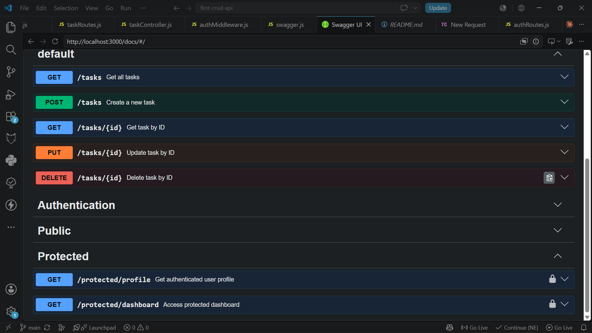

# FlyRank Backend Engineering API

A RESTful backend API built with Node.js and Express.js as part of the
FlyRank Backend Engineering internship.

The project started as a CRUD API and was progressively extended with
database persistence, PostgreSQL, Docker, Supabase Authentication,
JWT verification, protected routes, reusable authentication middleware,
and Swagger API documentation.

---

## Overview

This project demonstrates a backend API built progressively through the
FlyRank Backend Engineering assignments.

The current authentication implementation uses **Supabase Auth** as the
Identity Provider. Supabase manages user accounts, passwords, and signed
JWT access tokens. The Express backend is responsible for receiving,
verifying, and using those tokens to protect user-only routes.

### Main capabilities

- RESTful CRUD operations
- PostgreSQL database integration
- Docker-based database environment
- Supabase Authentication
- User signup
- User login
- JWT access-token verification
- Bearer token authentication
- Reusable Express authentication middleware
- Protected API routes
- Public API routes
- Logout
- Swagger UI documentation
- Environment-based configuration

---

## Tech Stack

| Technology | Purpose |
|---|---|
| Node.js | JavaScript runtime |
| Express.js | Web framework |
| Supabase Auth | Authentication and JWT issuing |
| PostgreSQL | Persistent database |
| Docker | Containerized environment |
| Swagger UI | Interactive API documentation |
| swagger-jsdoc | OpenAPI specification generation |
| dotenv | Environment variable loading |
| `@supabase/supabase-js` | Supabase JavaScript SDK |
| `pg` | PostgreSQL client |

---

# Project Structure

```text
first-crud-api/
│
├── config/
│   └── supabase.js
│
├── controllers/
│   └── taskController.js
│
├── docs/
│   └── swagger-auth.png
│
├── middleware/
│   └── authMiddleware.js
│
├── models/
│
├── repositories/
│   └── taskRepository.js
│
├── routes/
│   ├── authRoutes.js
│   └── taskRoutes.js
│
├── .env
├── .env.example
├── .gitignore
├── app.js
├── database.js
├── docker-compose.yml
├── Dockerfile
├── package.json
├── package-lock.json
├── README.md
└── swagger.js

